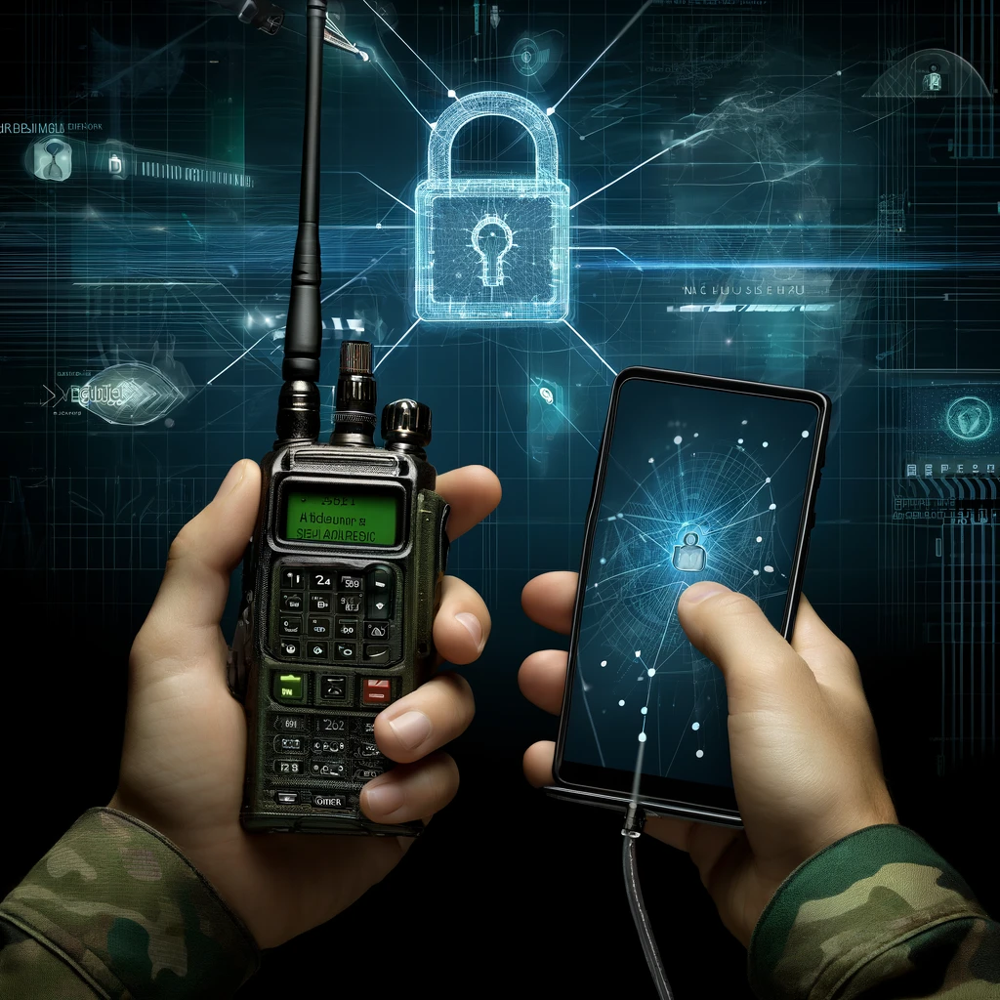

**Individual Student Project: Secure Communication System Using Baofeng Radios and Android Devices**

**Project Duration**: 3 months

**Objective**: The goal of this project is to develop a secure, encrypted communication system utilizing widely available consumer electronics: [[Baofeng]] UV-5R radios and **Android smartphones or any other Linux device**. This system aims to provide encrypted voice and data communication using amateur radio frequencies in a decentralized network.

**1. Hardware Setup and Integration**

- **Task Description**:
    - Connect Baofeng UV-5R radios to the device using a custom-built ([1](https://github.com/johnboiles/BaofengUV5R-TRRS),[2](https://willbradley.name/2015/08/09/aprs-via-rf-cable-for-connecting-aprsdroid-to-a-baofeng-radio/)) or [commercially available interface cable](https://baofengtech.com/product/aprs-k1/) that links the radio’s audio output and input to the smartphone’s 3.5mm audio jack.
- **Functional Requirements**:
    - Ensure reliable physical connection between the radios and devices, allowing for clear audio transmission and reception.
- **Performance Requirements**:
    - Minimize transmission delays and audio distortion.
    - Ensure the system can operate effectively in various environmental conditions.

**2. Software Development for Audio Modem and Encryption**

- **Task Description**:
    - Develop or adapt an existing audio modem software ([example](https://github.com/romanz/amodem)) to convert audio signals from the Baofeng radios into binary data that can be processed by  devices.
    - Implement encryption algorithms to secure communications.
- **Functional Requirements**:
    - The software must capture audio from the radio, convert it into digital data, encrypt it, and transmit it over the radio waves.
    - Implement a user-friendly interface on Android for managing communication settings and viewing the connection status.
- **Performance Requirements**:
    - Real-time data encoding and decoding with minimal latency.
    - Robust encryption to ensure that communications cannot be easily intercepted or decoded by unauthorized parties.

**3. Implementation of Packet Radio and IP over AX.25**

- **Task Description**:
    - Implement or configure packet radio software to use the AX.25 protocol, widely used in amateur radio for data communication, to create a decentralized IP network over radio waves.
- **Functional Requirements**:
    - Establish a stable IP network connection between multiple Android devices using AX.25 protocol.
    - Ensure compatibility with existing amateur radio regulations and standards.
- **Performance Requirements**:
    - Stable and reliable network performance with ability to handle simultaneous connections and data transfers.
    - Efficient handling of network packet loss and errors typical in radio frequency communications.

**4. Testing, Documentation, and Deployment**

- **Task Description**:
    - Test the complete system for functionality, security, and operational reliability.
    - Document the development process, including all configurations, code, and user manuals.
    - Deploy the system in a controlled environment to simulate real-world operation.
- **Functional Requirements**:
    - Conduct comprehensive tests to validate every component of the system.
    - Prepare detailed documentation that can be used for further development and deployment.
- **Performance Requirements**:
    - Ensure the system meets all predefined operational standards without failures.
    - Documentation should be clear and thorough enough to allow others to replicate or modify the system.

**Learning Resources**:

- Detailed tutorials and resources on AX.25, packet radio, and integrating electronics with Android devices.
- Online forums and publications on amateur radio technologies and encryption methods.
- [Is packet radio possible on Baofeng UV-5R and similar HTs?](https://ham.stackexchange.com/a/6552)
- [Baofeng UV-5R Series](https://www.miklor.com/UV5R/index.php)
- Chips datasheets ([1](https://cdn.datasheetspdf.com/pdf-down/R/D/A/RDA1846-RDA.pdf),[2](http://www.rudolf.net.pl/sp9kat/wp-content/uploads/stuff/trx/baofeng/uv5r/datasheets/rda5802%20fm%20reciever%20datasheet.pdf))
- [Modem](https://www.wikiwand.com/en/Modem)
- [Dire Wolf](https://github.com/wb2osz/direwolf)
- [TNC](https://en.wikipedia.org/wiki/Terminal_node_controller)
- [AX.25](https://en.wikipedia.org/wiki/AX.25)
- [AFSK1200](https://de.wikipedia.org/wiki/Audio_Frequency_Shift_Keying?oldformat=true)
- [EE123: Digital Signal Processing](https://sites.google.com/berkeley.edu/ee123-sp19/): 
    - [Labs](https://sites.google.com/berkeley.edu/ee123-sp19/labs): 
        - [Part 1](https://inst.eecs.berkeley.edu/~ee123/sp16/lab/lab5/Lab5-Part_I_Radio_Comm.html), [2](https://inst.eecs.berkeley.edu/~ee123/sp16/lab/lab5/Lab5_Part_2-Audio_Frequency_Shift_Keying(AFSK).html), [3](https://inst.eecs.berkeley.edu/~ee123/sp16/lab/lab5/Lab5_Part_C-APRS.html), [4](https://inst.eecs.berkeley.edu/~ee123/sp16/lab/lab5/Lab5_Part_D-APRS.html).
        - Cached: 
            - [Lab 5 Part III: AX.25 and APRS](https://yandexwebcache.net/yandbtm?fmode=inject&tm=1718041384&tld=ru&lang=en&la=1717124352&text=%28https%3A//inst.eecs.berkeley.edu/~ee123/sp16/lab/lab5/Lab5_Part_C-APRS.html&url=https%3A//inst.eecs.berkeley.edu/~ee123/sp16/lab/lab5/Lab5_Part_C-APRS.html&l10n=ru&mime=html&sign=bcdaf90ead3f9ebd607e0919c96c8c34&keyno=0)
            - [Lab 5 Part 2: Digital Communication with Audio Frequency Shift Keying (AFSK)](https://yandexwebcache.net/yandbtm?fmode=inject&tm=1718041306&tld=ru&lang=en&la=1716925440&text=https%3A//inst.eecs.berkeley.edu/~ee123/sp16/lab/lab5/Lab5_Part_2-Audio_Frequency_Shift_Keying%28AFSK%29.html&url=https%3A//inst.eecs.berkeley.edu/~ee123/sp16/lab/lab5/Lab5_Part_2-Audio_Frequency_Shift_Keying%28AFSK%29.html&l10n=ru&mime=html&sign=b12c9be9391e41b87ec1d71adc69f430&keyno=0)
- [IP over AX.25](https://blog.benjojo.co.uk/post/AX25-over-wifi-with-ESP8266)

